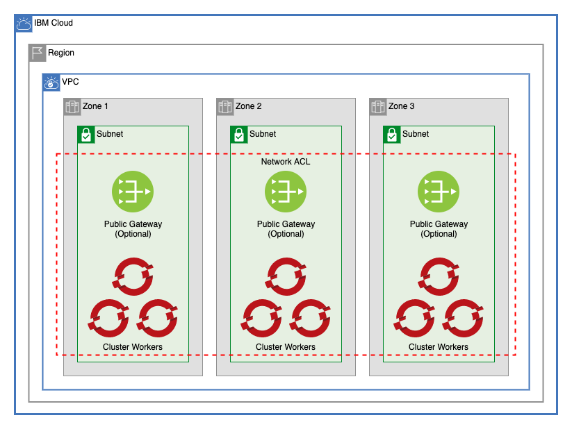

# Red Hat OpenShift on VPC Gen 2

This architecture creates a multizone VPC and an Openshift cluster on that VPC secured with IBM Cloud KeyProtect. [Read more about Openshift on IBM Cloud here](https://cloud.ibm.com/docs/openshift?topic=openshift-getting-started).

> See: https://jsw.ibm.com/browse/GCATUS-228

---

## Table of Contents

1. [Multizone VPC](#multizone-vpc)
2. [VPC Cluster](#vpc-cluster)

---

## Multizone VPC

This module creates a VPC in three zones of a single region, creates the ACL used by those subnets, and optionally provisions public gateways in all three zones. To read more about this module, refer to the [Multizone VPC README](./multizone_vpc/README.md).

Rather than using CIDR blocks, this module creates 3 subnets with 256 IP addresses using the `total_ipv4_address_count`. To use CIDR blocks, change the variables in [./multizone_vpc](./multizone_vpc).

---

## VPC Cluster

This module provisions the IKS cluster for this architecture. Optinally, it can enable ALBs and create additional worker pools. To read more about this module, refer to the [VPC Cluster README](./vpc_cluster/README.md)

---

## Module Variables

Variable | Type | Description | Default
---------|------|-------------|--------
`ibmcloud_api_key` | string | The IBM Cloud platform API key needed to deploy IAM enabled resources |
`unique_id` | string | A unique identifier need to provision resources. Must begin with a letter | `asset-roks-gen2`
`ibm_region` | string | IBM Cloud region where all resources will be deployed |
`resource_group` | string | Name of resource group to create VPC | `asset-development`
`generation` | String | generation for VPC. Can be 1 or 2 | `2`
`enable_public_gateway` | String | Enable public gateways for subnets, true or false | `true`
`acl_rules` | String | Access control list rule set |  `[`  `{`   `name        = "egress"`   `action      = "allow"`   `source      = "0.0.0.0/0"`    `destination = "0.0.0.0/0"`   `direction   = "inbound"` `},` `{`   `name        = "ingress"`    `action      = "allow"`   `source      = "0.0.0.0/0"`  `destination = "0.0.0.0/0"`   `direction   = "outbound"` `}`   `]`
`machine_type` | string | The flavor of VPC worker node to use for your cluster | `bx2.4x16`
`workers_per_zone` | number | Number of workers to provision in each subnet. Openshift worker pool size must be 2 or greater. | `2`
`disable_public_service_endpoint` | bool | Disable public service endpoint for cluster | `false`
`entitlement` | string | If you purchased an IBM Cloud Cloud Pak that includes an entitlement to run worker nodes that are installed with OpenShift Container Platform, enter entitlement to create your cluster with that entitlement so that you are not charged twice for the OpenShift license. Note that this option can be set only when you create the cluster. After the cluster is created, the cost for the OpenShift license occurred and you cannot disable this charge. | `cloud_pak`
`kube_version` | string | Specify the Kubernetes version, including the major.minor version. To see available versions, run ibmcloud ks versions. To use the default, leave string empty | `4.3.23_openshift`
`wait_till` | string | To avoid long wait times when you run your Terraform code, you can specify the stage when you want Terraform to mark the cluster resource creation as completed. Depending on what stage you choose, the cluster creation might not be fully completed and continues to run in the background. However, your Terraform code can continue to run without waiting for the cluster to be fully created. Supported args are `MasterNodeReady`, `OneWorkerNodeReady`, and `IngressReady` | `IngressReady`
`tags` | list(string) | A list of tags to add to the cluster | `[]`
`worker_pools` | String | List of maps describing worker pools. Worker pools must have at least 2 workers per zone | `[]`
